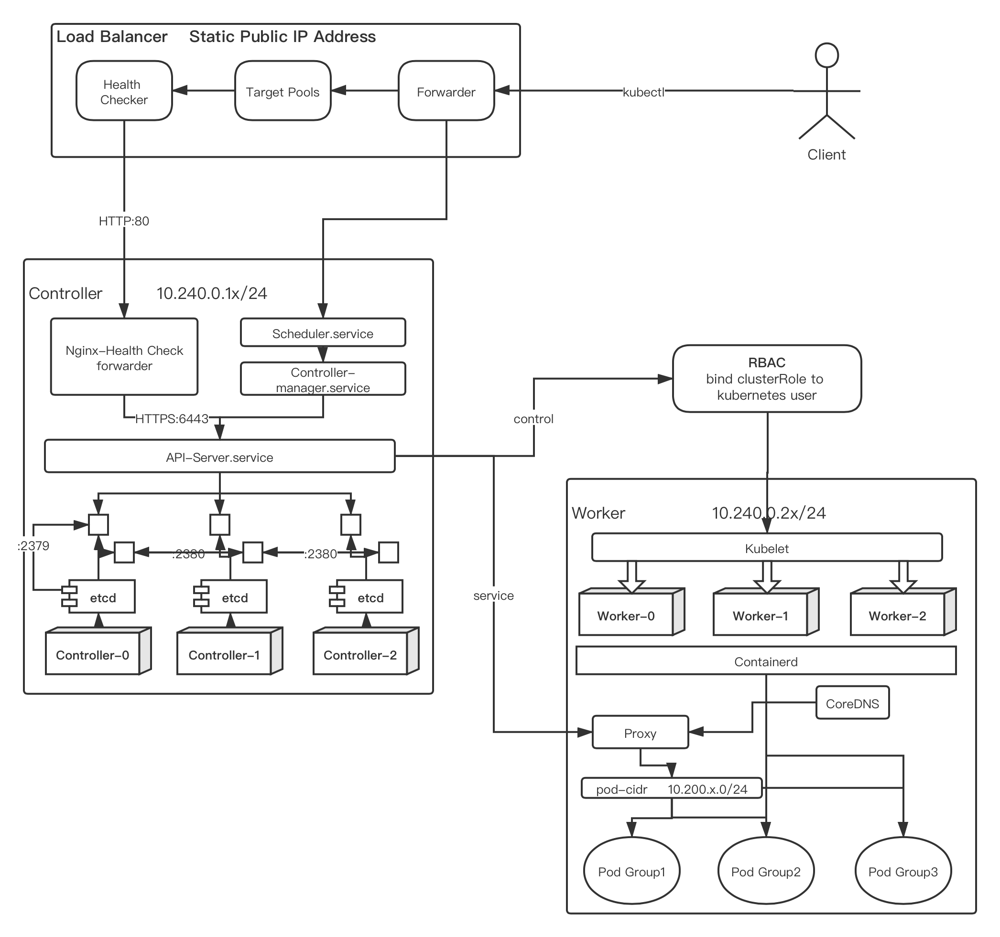

# terraform_study

This project is followed by [Kubernetes the Hard Way](https://github.com/kelseyhightower/kubernetes-the-hard-way/).

Terraform is used to automate the whole process to build the infrastructures, create a Kubernetes cluster and deploy a nginx pod into the cluster, all from scratch.

All the deployment is based on GCP.

## Architecture of this Project



## How to use

### Operate locally

1. Assign your GCP credential json file in main.tf/provider "google"

2. Set up your project_id in your GCP, at variables.tf/variable "PROJECT_ID"
3. Choice your own settings like controller&worker instance type, number in variables.tf
4. Execute ```terraform plan``` in the terminal to see the details of the changes
5. Execute ```terraform apply``` in the terminal to apply all the changes
6. Destory all the infrastructures by executing ```terraform destory```

### Automatic apply based on GitHub  operations

#### Use Terraform Cloud

1. Fork the repo to your own 

2. Set up a workspace in your terraform cloud account, choose "version control Workflow" and assign it to your GitHub repo

3. Set an Environment Variables in terraform cloud: 

   ​	GOOGLE_CREDENTIALS - save the GCP credential json file.

   ​		**Note: you may need to write the whole context into one single line**

4. Set a secret in your Github:

   ​	TF_API_TOKEN - save the credential token of your terraform cloud(generated in terraform cloud)

5. Merge a Pull Request or Push to the default branch (can be choose in your workspace) of the repo, it will trigger a ```terraform apply``` action in your terraform cloud. If there is no error, your can conform the apply in your Terraform cloud, then all the changes will be deployed to  your GCP.

Note: This automatic operation is done by terraform cloud. It monitors the repo automatically. By default, terraform cloud would be the backend, and maintain the status itself.

#### Use GitHub Actions

1. Fork the repo to your own
2. Define the action file: ./github/workflows/terraform.yml

Set up the trigger action: 

```HCL2
on:
  push:
    branches:
      - the branch you would like to monitor
  pull_request:
```

Set your own branch that you would like to monitor.

3. Set up your GCP credential

```HCL2
- name: GCP
	uses: GoogleCloudPlatform/github-actions/setup-gcloud@master
  with:
    version: '290.0.1'
    project_id: ${{ secrets.GCP_PROJECT_ID }}
    service_account_key: ${{ secrets.GCP_SA_KEY }}
    service_account_email: ${{ secrets.GCP_SA_EMAIL }}
    export_default_credentials: true
```

Don't forget to set your credential into GitHub secrets.

```GCP_SA_KEY``` is the GCP credential json file

```GCP_PROJECT_ID``` is the id of project that you would like to run the project

```GCP_SA_EMAIL``` is the email address of manager

4. Set up the monitor of "push" action

```HCL2
- name: Terraform Apply
  if: github.ref == 'refs/heads/main' && github.event_name == 'push'
  run: terraform apply -auto-approve
```

replace ```refs/heads/main``` with your own branch name, should be the same as defined  in step2

## Auto comment by GitHub Actions

The whole output of the Plan operation is too long and includes some sensitive information, so it should be filtered before commented on GitHub.

In this project, "#" is used to identify the important information which indicates the name of infrastructures that should be modified. 

```javascript
process.env.PLAN.match(/\# (.+\n)/g).join("")
```

## Note

### Auto generated certificates/pem

All the certificates are sensitive, please keep them save

All the pem files will not output by default. If you want to use them anywhere else, uncomment the ```resource "local_file"``` section in the cert_xxx.tf files. Then the selected certificate files will output in /certs/

### Backend

The tfstate file is sensitive. If you run this project locally, please keep it save.

If you don't declare a backend in your project, the state will be saved locally by default. So if you run the command on your computer, the file will be saved into the project directory.

Note: if you run the project on Github Actions without declaring a backend, the state would be lost, because GitHub Actions are executed in temporary environment.

Backend is used to store the tfstate file, including "aws/s3", "gcp/gcs", "azurerm", "terraform cloud" and so on.

1. Terraform Cloud

```HCL2
backend "remote" {
  organization = "kubernetes-the-hard-way"

  workspaces {
    name = "terraform_study"
  }
}
```

Make sure:

The organization and workspaces are exactly the same as those in your Terraform Cloud.

2. GCS

```HCL2
backend "gcs" {
  bucket  = "kubernetes-study"
  prefix  = "terraform/state"
}
```

Make sure you have already create the bucket in your gcs with the same name. The prefix is the path where the tfstate file save 

If you use the same backend both in your local computer and Github Actions, the state and operation is continued. 

So if you would like to destroy the infrastructures which created by GitHub Actions, you can run ```terraform destroy``` on your local computer with the declaration of the same backend.